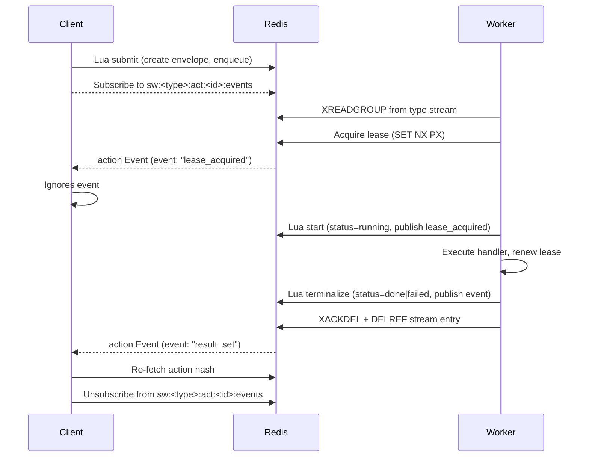

# Swarm System Design

This document describes the architecture for the `maa.swarm` task fabric. The swarm delivers **durable** task submission, **effectively-once** execution, and **observable** progress through a design centred on **type-partitioned Redis Streams**, **per-action pub/sub wakeups**, and **lease-fenced Lua state transitions**.

## Goals

- **Low-latency dispatch:** Submissions should be noticed by eligible workers immediately while avoiding thundering herds.
- **Effectively-once execution:** Deterministic identifiers ensure that retries converge on a single action record.
- **Resilience to worker failure:** Leases detect crashed workers and allow safe takeover.
- **Scalability:** Per-type partitioning and sharding allow large backlogs and diverse runtimes.
- **Tolerance for variable runtimes:** Workers can execute actions that range from milliseconds to many minutes.

## Architectural Roles

The swarm involves three logical actors:

1. **Clients** prepare and submit actions, then wait for completion by monitoring per-action events.
2. **Workers** declare which action types they can execute, lease and process actions, and report completion or failure.
3. **Redis** is the sole coordinator, providing storage, streams, pub/sub, and Lua primitives for fencing.

## Redis Data Model

All action state is **type-scoped**. Keys for one action never cross Redis hash slots when clustered by using hash-tags derived from the action identifier.

| Key | Type | Purpose |
| --- | ---- | ------- |
| `sw:<type>:act:<id>` | Hash | Canonical action envelope containing `type`, `params`, `status`, `result`, `error`, `error_count`, `latest_expected_completion`, `submitted_at`. |
| `sw:<type>:act:<id>:lease` | String | Opaque lease token (`SET NX PX`); renewed with `SET XX PX`. |
| `sw:<type>:dispatch` | Redis Stream | Durable dispatch log for the type. Entries contain `act_id` and auxiliary metadata. |
| `sw:<type>:act:<id>:events` | Pub/Sub channel | Broadcast wakeups for the action (`lease_acquired`, `result_set`, `error_set`). |
| `sw:meta:workers:<worker_id>` | Hash | Cross-type worker heartbeat: `capabilities`, `last_heartbeat`, `inflight`, `max_concurrency/<type>`. |

> Only worker metadata is cross-type. All other state is partitioned by action type.

### Events

Events are advisory wakeups. Consumers must re-read the authoritative action hash after receiving an event.

Payload schema:

```json
{
  "act_id": "<id>",
  "type": "<type>",
  "event": "lease_acquired | result_set | error_set",
  "ts": <server_time_float>
}
```

### Streams and Consumer Groups

Each type has a dedicated Redis Stream (`sw:<type>:dispatch`) with a single consumer group (`sw:<type>:cg`). Workers complete entries with a single `XACKDEL sw:<type>:dispatch sw:<type>:cg <consumer> <id...>` call, optionally batching multiple IDs per command. The atomic ack-and-delete keeps the stream tidy without extra round-trips. A follow-up `DELREF sw:<type>:dispatch sw:<type>:cg <id...>` removes any dangling pending-entry references, ensuring even stray consumer groups cannot retain the entry. Periodic `XTRIM MAXLEN ~ N` (or `MINID` watermarks) remains as a belt-and-braces safeguard but should usually be a no-op because entries disappear immediately after completion.

#### Why aggressive deletion works

The dispatch stream carries no replay or audit requirements in this design; once an action completes the entry may be removed. `XACKDEL` provides an O(1) atomic acknowledgement plus deletion, avoiding the double round-trip of `XACK` followed by `XDEL`. `DELREF` further guarantees the entry cannot linger in a pending entries list if a temporary consumer group was created during testing. Because workers remove entries eagerly, trimming operations become a safety net rather than a routine maintenance task.

## Lifecycle and Lua Contracts

All multi-step updates use Lua to guarantee atomicity and lease fencing. The overall lifecycle is illustrated below.



### Submission (write-before-notify)

1. Clients compute `id = H(type, canonical(params))`, reusing existing canonicalisation.
2. A Lua script initialises `sw:<type>:act:<id>` with `status=pending`, `error_count=0`, and `submitted_at=TIME` if the action is new. If the action already exists and is non-terminal (`pending` or `running`), it is returned without re-enqueue. Terminal states are also returned untouched, delivering idempotent submissions.
3. The same script enqueues the action once via `XADD sw:<type>:dispatch * act_id=<id>`.
4. No pub/sub event is published during submission; workers discover work through the stream.

### Dispatch and Leasing

1. Workers issue `XREADGROUP GROUP sw:<type>:cg <consumer> ... STREAMS sw:<type>:dispatch >` to claim pending entries.
2. For each entry, the worker fetches the action hash. Missing or terminal actions result in an `XACKDEL` and skip.
3. Lease acquisition uses `SET sw:<type>:act:<id>:lease <token> NX PX <lease_ms>`. Failure indicates another worker holds the lease, so the entry is acknowledged and dropped.
4. Upon lease success, a Lua script marks the action `status=running`, sets `latest_expected_completion` based on `TIME`, and publishes `lease_acquired`.
5. Workers renew the lease periodically with `SET XX PX <lease_ms>` while executing user code.

### Terminalisation (success or failure)

After execution, workers run a Lua terminalisation script:

- If `status` is already terminal, the script is a no-op (first terminal writer wins).
- On success, the script writes `result`, sets `status=done`, applies coordinated TTLs to the action hash and lease key, and publishes `result_set`.
- On failure, the script updates `error`, increments `error_count`, sets `status=failed`, applies the same TTL discipline, and publishes `error_set`.

After the terminal script, the worker retires the dispatch entry with `XACKDEL` (batching IDs when convenient) and issues a matching `DELREF` to clean up any lingering pending entries owned by other consumer groups. This keeps the stream free of completed items without requiring separate pruning commands.

### Client Consumption Pattern

Clients follow a fetch-then-subscribe flow to avoid missing completions:

1. Read `sw:<type>:act:<id>` to observe current state.
2. Subscribe to `sw:<type>:act:<id>:events` for wakeups.
3. On each event, re-fetch the action hash to obtain authoritative status, result, or error details.
4. Use `latest_expected_completion` in conjunction with Redis `TIME` to bound wait times for long-running actions.

## Lease and Fencing Semantics

- Lease tokens are opaque, unique strings supplied by workers. Renewals must include the same token.
- Terminal scripts enforce "first terminal writer wins". Late writers who find a terminal state skip further mutations.
- If a worker's lease expires before completion but no terminal write occurred yet, any subsequent worker may acquire the lease and finish the action. A late completion by the original worker is accepted only if the state is still non-terminal.

## Expiry Discipline

Terminalisation scripts assign TTLs to both `sw:<type>:act:<id>` and `sw:<type>:act:<id>:lease`. Stream entries are not relied on for completion tracking; operators can trim acknowledged entries. Pub/Sub events have no retention by design—they only wake subscribers.

## Worker Metadata and Heartbeats

Workers refresh `sw:meta:workers:<worker_id>` using `SETEX`, storing:

- `capabilities`: list of supported types.
- `last_heartbeat`: Redis `TIME` timestamp.
- `inflight`: count of currently leased actions.
- `max_concurrency/<type>`: configured concurrency caps per type.

This key is the only cross-type structure and enables fleet observability.

## Scaling and Sharding

Per-type isolation simplifies scaling. When a type becomes hot, operators may shard its dispatch stream into `sw:<type>:dispatch:<shard>` and route actions by `hash(id) % shard_count`. All other semantics remain unchanged, and each shard maintains its own consumer group.

Redis Cluster deployments should use hash-tags such as `sw:<type>:{<id>}:act` and `sw:<type>:{<id>}:lease` to keep per-action keys colocated for Lua scripts.

## Out of Scope

The current fabric intentionally excludes:

- Retry backoff or delayed requeue logic (no delayed queues or sorted-set movers).
- Cancellation semantics.
- In-Redis telemetry feeds (timing metrics must be exported to external systems).

These behaviours can be layered on top without modifying the core dispatch model.

