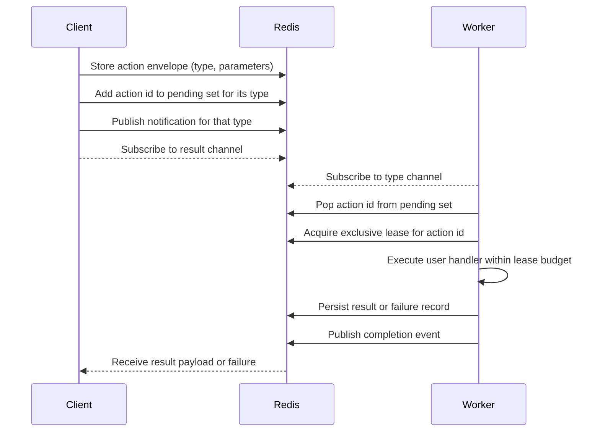

# Swarm System Design Overview

This document describes the intended behaviour of the `maa.swarm` task fabric from a systems perspective.  The swarm is designed to deliver **durable** task submission, **idempotent** execution, and **observable** progress across a pool of cooperative workers.  Durability is achieved by persisting every action's metadata and results in Redis before acknowledging submission—however, this durability is only as strong as the Redis instance's own persistence configuration.  If Redis is configured without persistence (e.g., as a pure in-memory store), then data may be lost on restart, and actions may be re-run at a future date.  Idempotency follows from deriving deterministic action identifiers so retries reuse existing state rather than duplicating work.  Observability stems from publishing state transitions and timings to dedicated Redis channels and lists that can be consumed by monitoring tooling.

## Goals

The goals of the swarm are:
 - Fast, this is a task queue for distributed workers, but an action (task) submission should be picked up immediately by one waiting worker (if there are any waiting) without any poll delay, and avoiding thundering herd issues
 - effectively-once execution, with the constraint of a single central redis coordination server, and putting aside general system failure modes, actions should be executed effectively once by a worker that is configured to run the action, multiple requests to run the same action (same type and parameters) still result in the action being run once.
 - tolerant of worker crashes and transient errors, action runs get leased to a worker, and an unextended lease will expire, returning the action to the queue, likewise, errors running actions (up to a limit) cause the action to be requeued with an increased error count.
 - Scalable, a job may queue up 1,000 action runs in one batch and wait for them all to complete, workers must be efficient at acquiring jobs, but also maintain a reasonable throughput of jobs (depending on actual action execution time).
 - Tolerant of varying action execution times - actions may take 30ms or 30 minutes to complete, with an appropriate configuration of workers assigned to different action types, the system should handle both transparently and efficiently.

## Architectural Roles

A deployment contains three logical roles:

1. **Clients** encode an action request, compute its deterministic identifier, and persist the request in Redis before broadcasting that new work is available.  Clients later wait on a result channel tied to the action identifier.
2. **Workers** advertise which action types they can execute, obtain exclusive leases on pending actions, run the user-supplied logic, and commit results or failure metadata back to Redis.  Workers continuously renew their leases and publish heartbeats so external supervisors can detect unhealthy nodes.
3. **Redis Coordinator** provides strongly consistent primitives for durability (string and hash storage), exclusivity (locks implemented with Lua or `SET NX PX` semantics), and fan-out (pub/sub channels and lists).  All coordination data lives under namespaced keys (`act/<id>/*`, `act-pending/<type>`, `workers/<id>`), keeping the system stateless outside Redis.

The diagram below highlights the interaction pattern between these roles.

## Redis Data Model

Redis holds every piece of mutable state for the swarm.  The following keys illustrate the canonical data layout; implementations can reproduce behaviour by recreating these structures:

| Key | Type | Purpose |
| --- | ---- | ------- |
| `act/<id>/type` | String | Action type identifier used to dispatch handlers. |
| `act/<id>/params` | String | Serialized parameters captured at submission. |
| `act/<id>/lease` | Lock token | Represents exclusive ownership while a worker executes the action. |
| `act/<id>/latest_expected_completion` | Float | Timestamp when the current lease is expected to finish; informs client wait deadlines. |
| `act/<id>/result` | String | Serialized result payload written on success. |
| `act/<id>/failed` | String flag | Marks terminal failure; clients convert this into an exception. |
| `act/<id>/error_count` | Integer | Counts consecutive execution failures for bounded retries. |
| `act/<id>/last_error` | String | Encoded diagnostic information from the most recent failure. |
| `act-pending/<type>` | Set | Pool of outstanding action ids per type.  Workers pop from this set to claim work. |
| `act-pending/<type>` (channel) | Pub/Sub | Notifies workers that new work is available to minimise latency. |
| `act/<id>/result` (channel) | Pub/Sub | Broadcasts completion to waiting clients. |
| `workers/<worker_id>` | Hash | Heartbeat and capability metadata for observability. |
| `action-times/<type>` | List | Rolling window of timing metrics (requested timeout, actual runtime, slack). |

## Lifecycle, Consistency, and Idempotency

### Submission

1. Clients compute the action identifier as a cryptographic hash of `(type, serialized parameters)`.  Because the hash function is deterministic, retries targeting the same logical request reuse the same identifier and therefore the same Redis records.
2. The client writes the action envelope (`type`, `params`, timeout configuration) to Redis before publishing.  This write-before-notify pattern guarantees that a worker never observes a reference to non-existent action metadata, providing durable submission even if the client crashes immediately after publishing.
3. The action identifier is inserted into the `act-pending/<type>` set and broadcast over the matching pub/sub channel.  Workers can recover missed notifications by rescanning the set, so notifications are at-least-once.

### Execution

1. A worker listening for its supported types removes an identifier from the pending set and acquires an exclusive lease key scoped to that action.  Implementations typically rely on `SET NX PX` semantics to both lock and define a lease timeout in a single operation.
2. Before invoking user logic, the worker records a `latest_expected_completion` timestamp so that clients have a concrete deadline for long-running actions.  Workers periodically extend the lease while work continues, ensuring only one executor operates on the action at a time.
3. Successful executions persist the result payload, set a shared expiry for all action keys (avoiding unbounded growth), and publish a completion notification.  Clients waiting on the dedicated result channel consume this message and resolve the original request.

### Failure Handling

1. Exceptions increment `error_count` and capture the serialized failure context in `last_error`.
2. If the count remains below a configured threshold, the worker re-enqueues the action by returning it to the pending set and republishing the notification.  This yields retry semantics without losing the original request metadata.
3. When the threshold is exceeded, the worker marks the action as failed (`failed = 1`), publishes the terminal event, and refrains from further retries.  Clients convert the failure record into an application-level error, preserving transparency about why the request did not succeed.

### Nested and Dependent Workflows

Complex actions may trigger additional swarm actions.  To avoid deadlocks and premature timeouts:

* Workers retain a context of their active leases.  Before submitting dependent actions they temporarily extend their own lease so the parent request remains valid while waiting.
* Nested workers reuse the caller's Redis connection and respect the same deterministic identifier scheme, ensuring idempotency across the dependency graph.
* When nested work completes, any unused lease budget is refunded, preventing runaway lock extensions that could reduce throughput.

## Durability and Consistency Guarantees

**Note:** Durability guarantees are provided within the context of the Redis store. If Redis is configured without persistence, all action data exists only in memory and will be lost on Redis restart, which may result in actions being re-run at a future date.

* **At-least-once execution:** Deterministic identifiers ensure duplicate submissions collide, while the combination of pending sets and notifications guarantees that work remains discoverable even after worker failures.
* **Mutual exclusion via leases:** Only the lease holder may modify an action's result fields.  Lease expirations allow other workers to recover abandoned tasks.
* **Bounded retries with transparency:** Error counters and failure markers make retry policies explicit.  Because results and last errors are persisted, clients can audit every state transition.
* **Data expiry discipline:** When an action reaches a terminal state, TTLs are assigned to all related keys.  This prevents stale state from affecting future scheduling decisions while still offering a window for diagnostics.

## Design Considerations and Trade-offs

Several questions and concerns naturally arise when examining the swarm's architecture. This section documents those considerations and the design responses:

* **Serialization stability:** The action key derivation relies on deterministic serialization of parameters. The swarm uses the `tobytes` library to ensure consistent byte representations across invocations. Because action keys expire with their configured timeout, actions do not live indefinitely in Redis, making this approach low risk even if serialization conventions evolve over time.

* **Poisoned collisions:** It is critical that actions model pure functions such that the same input consistently produces the same output. This property is not strictly enforced by the swarm itself, but must be a core principle when designing worker handlers. Violating purity can lead to confusing behavior when retries or duplicate submissions resolve to cached results that no longer match current expectations.

* **SPOP then lease race:** If a worker pops an action identifier from the pending set but fails to acquire the lease (because another worker already holds it), no requeue is necessary. The goal is to have one worker actively processing the action, so if another worker has successfully leased it, the action is already being handled. The popping worker simply moves on to the next pending item.

* **Hot-loop requeues:** Immediate requeue on error can amplify failure storms, especially when many workers encounter the same persistent issue. This concern is explicitly out of scope for the swarm fabric. Clients and worker implementations are expected to manage backoff strategies or circuit-breaking logic as required by their operational environment.

* **Writes with expired leases:** If a task completes after its lease has expired, it is still permitted to write its result to the action data, even though this may seem counterintuitive. Lease expiry serves to detect hangs and crashes, enabling other workers to recover abandoned work. However, if an action does eventually complete, the system assumes the result is valid. Duplicate writes to an action result are acceptable because successful completion is the desired outcome regardless of which worker produces it.

## Observability and Operations

* **Telemetry feeds:** Workers append timing samples to `action-times/<type>`, enabling external services to compute percentiles or detect latency regressions.
* **Heartbeats:** Each worker periodically refreshes `workers/<worker_id>` with the action types it supports and the timestamp of the last successful lease extension.  Supervisors can scan these hashes to identify missing workers.
* **Structured events:** Custom progress events can be published per action.  Clients or monitoring consumers subscribe to the action-specific channel to receive these updates, making long-running tasks auditable.

## Extensibility Expectations

An independent implementation can adopt this design by re-creating the same contract:

1. Encode action envelopes, deterministic identifiers, and pending queues as described above.
2. Provide worker runtimes that execute user code within lease-guarded critical sections, persisting outcomes atomically with notifications.
3. Surface operational insights—timings, heartbeats, error metadata—through the documented Redis structures so that external tooling remains compatible.

By adhering to these patterns, any implementation can deliver the same durable, idempotent, and observable task execution semantics expected of the `maa.swarm` system.
